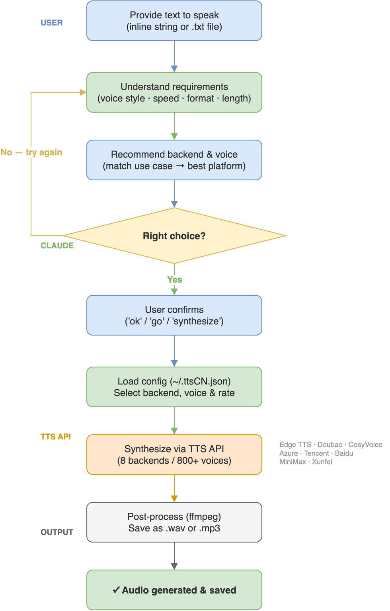

# ttsCN — Multi-Platform Chinese TTS Skill

[](LICENSE)
[](https://github.com/Agents365-ai/ttsCN/stargazers)
[](https://github.com/Agents365-ai/ttsCN/network/members)
[](https://github.com/Agents365-ai/ttsCN/releases/latest)
[](https://github.com/Agents365-ai/ttsCN/commits/main)

[](https://skillsmp.com)
[](https://clawhub.ai)
[](https://github.com/Agents365-ai/365-skills)
[](https://agentskills.io)

[中文文档](README_CN.md)

> **ttsCN — TTS, Cloud-Native: one CLI, every TTS cloud.**

Generate natural speech audio from text — **11 backends** behind one CLI. The project
started with China-friendly clouds (those 8 still work in China, no VPN needed) and now
covers the international clouds too — ElevenLabs, OpenAI, Google — so the name fits
better than ever.

Works with Claude Code, Cursor, Codex, Copilot, Windsurf, Cline / Roo Code, Gemini CLI,
Aider, Zed, OpenCode, OpenClaw / ClawHub, Hermes, pi-mono — plus major Chinese agents
(Trae, Qwen Code / Tongyi Lingma, Baidu Comate, CodeGeeX) — and any agent that reads
the [Agent Skills](https://agentskills.io) format.

| Feature | Edge TTS | Doubao | CosyVoice | Azure |
|---------|----------|--------|-----------|-------|
| Cost (per 10K chars) | **Free** | ~1 RMB | ~2 RMB | ~$1/M chars |
| API key | None | Required | Required | Required |
| Chinese voices | 20+ | 8 | 7 | 20+ |
| SSML | Yes | No | No | Yes |
| Setup | Zero | Medium | Easy | Medium |

| International | ElevenLabs | OpenAI TTS | Google Cloud TTS |
|---------------|-----------|-----------|------------------|
| Cost (approx.) | Paid tiers, from $5/mo | ~$15-30/M chars | ~$16/M chars, free tier |
| API key env | `ELEVENLABS_API_KEY` | `OPENAI_API_KEY` | `GOOGLE_TTS_API_KEY` |
| Voices | 20+ preset + cloning | 6 | 220+ |
| Voice cloning | Yes (paid) | No | No |

Full 11-backend comparison (incl. Tencent / Baidu / MiniMax / Xunfei / ElevenLabs / OpenAI / Google): [docs/providers.md](skills/ttsCN/docs/providers.md)

## Pipeline



## Quick Start

```bash
# Install (default Edge backend — free, no API key)
pip install edge-tts

# Generate speech
python skills/ttsCN/scripts/tts.py "你好世界" output.wav
```

## Backends

### Edge TTS (Default — Free)
Microsoft Edge TTS via WebSocket. No API key, no registration, works everywhere.

### Doubao (ByteDance Volcano Ark)
Premium Mandarin voices optimized for short video / social media content.

### CosyVoice (Alibaba DashScope)
Fast streaming TTS with diverse voice styles — audiobooks, education, customer service.

### Azure (Microsoft)
Enterprise-grade TTS with rich SSML support. Use **eastasia** region for China.

### ElevenLabs (International)
Top-tier voice quality with instant voice cloning. Paid subscription tiers (from ~$5/mo). Default voice: Rachel.

### OpenAI TTS (International)
Simple REST API, 6 voices, multilingual auto-detect. ~$15-30/M chars (approximate). Default model `tts-1-hd`.

### Google Cloud TTS (International)
220+ voices across 40+ languages (incl. Mandarin). ~$16/M chars with a monthly free tier (approximate). Language auto-derived from the voice name.

## Voice Examples

```bash
# Female, warm (default) — general purpose
python skills/ttsCN/scripts/tts.py "你好，欢迎使用语音合成。" default.wav

# Male, energetic — vlog, narration
python skills/ttsCN/scripts/tts.py --voice zh-CN-YunxiNeural "今天我们来聊聊..." vlog.wav

# Male, deep — documentary
python skills/ttsCN/scripts/tts.py --voice zh-CN-YunyangNeural "在这片古老的土地上..." doc.wav

# Douyin style — faster, livelier
python skills/ttsCN/scripts/tts.py --platform doubao --rate +10% "家人们！" douyin.wav
```

## Voice Cloning

Clone your own voice and use it by name (built-in for MiniMax and CosyVoice):

```bash
# MiniMax — local audio file, paid (~$1.5/voice), confirm with --yes
python skills/ttsCN/scripts/tts.py clone create --platform minimax --audio my.wav --name myvoice --yes

# CosyVoice — free enrollment, audio must be a public URL (10-20s)
python skills/ttsCN/scripts/tts.py clone create --platform cosyvoice --audio https://example.com/my.wav --name myvoice

# Speak with your voice
python skills/ttsCN/scripts/tts.py "用我的声音说这句话" out.wav --platform minimax --voice myvoice
```

`clone list` / `clone delete --name X` manage stored voices (`~/.ttsCN.json`). Only clone voices you own or are authorized to use. Note: a new MiniMax clone is temporary — use it in a real synthesis within 7 days (global site) / 48 h (China site) of creation or it is deleted (previews don't count); it is kept permanently after first use. CosyVoice voices expire after 1 year unused.

## Word Timestamps, Pause Markers & Pronunciation Overrides

**Word-level timestamps** (edge / azure / doubao / minimax / cosyvoice): the JSON success envelope includes
`data.word_boundaries` — native per-word timings in seconds, absolute within the
output file. Absent for other platforms.

```json
"word_boundaries": [
  {"text": "你好", "offset_sec": 0.1, "duration_sec": 0.45},
  {"text": "世界", "offset_sec": 0.562, "duration_sec": 0.5}
]
```

**Expressiveness markers** — accepted in input text on all platforms, never read aloud:
`[PAUSE:0.8]` (pause in seconds, 0.01-99.99) and sound tags `(laughs)` `(chuckle)`
`(sighs)` `(breath)` `(inhale)` `(exhale)` `(coughs)`. Azure renders pauses as SSML
breaks; MiniMax renders pauses as `<#x#>` and voices sound tags when
`MINIMAX_MODEL` is a `speech-2.8` model; other platforms strip all markers.

**Pronunciation overrides** — `--phonemes overrides.json` fixes polyphonic Chinese
characters, e.g. `{"行长": "hang2 zhang3"}`. Azure uses SSML phoneme tags, MiniMax
inline pinyin annotations; other platforms ignore the flag.

## Config File

Create `~/.ttsCN.json` for defaults:

```json
{
  "backend": "edge",
  "voice": "zh-CN-XiaoxiaoNeural",
  "rate": "+5%"
}
```

## Install

### Claude Code
```bash
# Plugin marketplace (recommended)
/plugin install ttsCN@365-skills
```

Or tell your coding agent:
> help me to install https://github.com/Agents365-ai/ttsCN.git

```bash
# Manual — copy the inner skill folder (SKILL.md must sit at the install root)
git clone https://github.com/Agents365-ai/ttsCN.git /tmp/ttsCN
cp -r /tmp/ttsCN/skills/ttsCN ~/.claude/skills/ttsCN
```

### OpenClaw
```bash
git clone https://github.com/Agents365-ai/ttsCN.git /tmp/ttsCN
cp -r /tmp/ttsCN/skills/ttsCN ~/.openclaw/skills/ttsCN
```

### SkillsMP
Discover and install at [skillsmp.com](https://skillsmp.com).

## Support

If this project helps you, feel free to support the author:

<table>
  <tr>
    <td align="center">
      
      <br>
      <b>WeChat Pay</b>
    </td>
    <td align="center">
      
      <br>
      <b>Alipay</b>
    </td>
    <td align="center">
      
      <br>
      <b>Buy Me a Coffee</b>
    </td>
    <td align="center">
      
      <br>
      <b>Reward</b>
    </td>
  </tr>
</table>

## Author

**Agents365-ai**

- Bilibili: https://space.bilibili.com/441831884
- GitHub: https://github.com/Agents365-ai

## License

[CC BY-NC 4.0](LICENSE) — Free for non-commercial use. Commercial use requires permission.
