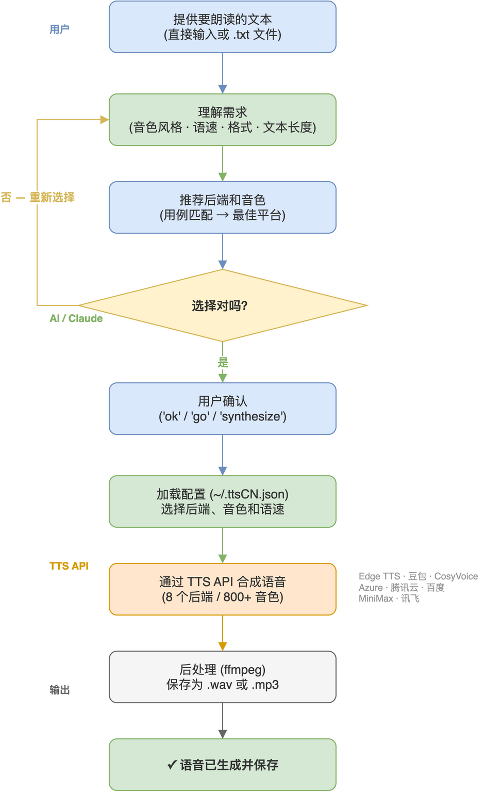

# ttsCN — 多平台中文语音合成技能

[](LICENSE)
[](https://github.com/Agents365-ai/ttsCN/stargazers)
[](https://github.com/Agents365-ai/ttsCN/network/members)
[](https://github.com/Agents365-ai/ttsCN/releases/latest)
[](https://github.com/Agents365-ai/ttsCN/commits/main)

[](https://skillsmp.com)
[](https://clawhub.ai)
[](https://github.com/Agents365-ai/365-skills)
[](https://agentskills.io)

[English](README.md)

> **ttsCN — TTS, Cloud-Native：一个 CLI，接入所有 TTS 云端。**

将文本转换为自然语音——**11 个后端**，一个 CLI。项目从对国内友好的云服务起步
（这 8 个后端至今均可在国内直连，无需 VPN），如今也接入了国际云端——ElevenLabs、
OpenAI、Google——这个名字比以往任何时候都更贴切。

支持 Claude Code、Cursor、Codex、Copilot、Windsurf、Cline / Roo Code、Gemini CLI、
Aider、Zed、OpenCode、OpenClaw / ClawHub、Hermes、pi-mono，以及主流国产编程助手
（Trae、通义灵码 / Qwen Code、百度 Comate、CodeGeeX）——任何能读取
[Agent Skills](https://agentskills.io) 格式的智能体均可使用。

| 特性 | Edge TTS | 豆包 | CosyVoice | Azure |
|------|----------|------|-----------|-------|
| 费用（每万字符） | **免费** | ~1元 | ~2元 | ~$1/百万字符 |
| API密钥 | 无需 | 需要 | 需要 | 需要 |
| 中文音色 | 20+ | 8 | 7 | 20+ |
| SSML | 支持 | 不支持 | 不支持 | 支持 |
| 配置难度 | 零 | 中 | 易 | 中 |

| 国际后端 | ElevenLabs | OpenAI TTS | Google Cloud TTS |
|----------|-----------|-----------|------------------|
| 费用（约） | 订阅制，$5/月起 | ~$15-30/百万字符 | ~$16/百万字符，含免费额度 |
| API 密钥环境变量 | `ELEVENLABS_API_KEY` | `OPENAI_API_KEY` | `GOOGLE_TTS_API_KEY` |
| 音色 | 20+ 预置 + 复刻 | 6 | 220+ |
| 声音克隆 | 支持（付费） | 不支持 | 不支持 |

完整 11 后端对比（含腾讯云 / 百度 / MiniMax / 讯飞 / ElevenLabs / OpenAI / Google）：[docs/providers.md](skills/ttsCN/docs/providers.md)

## 工作流程



## 快速开始

```bash
# 安装（默认 Edge 后端 — 免费，无需 API Key）
pip install edge-tts

# 生成语音
python skills/ttsCN/scripts/tts.py "你好世界" output.wav
```

## 后端选择

### Edge TTS（默认 — 免费）
微软 Edge 浏览器 TTS，通过 WebSocket 连接。无需注册，无需 API Key，开箱即用。

### 豆包（字节跳动火山引擎）
优质普通话语音，针对短视频/社交媒体内容优化。

### CosyVoice（阿里云百炼/DashScope）
快速流式语音合成，多种声音风格 — 有声书、教育、客服场景。

### Azure（微软）
企业级语音合成，丰富的 SSML 支持。推荐使用 **eastasia**（东亚）区域。

### ElevenLabs（国际）
顶级音质，支持即时声音克隆。付费订阅（约 $5/月起）。默认音色：Rachel。

### OpenAI TTS（国际）
简洁的 REST API，6 个音色，多语言自动识别。约 $15-30/百万字符（估算）。默认模型 `tts-1-hd`。

### Google Cloud TTS（国际）
220+ 音色，覆盖 40+ 语言（含普通话）。约 $16/百万字符，每月含免费额度（估算）。语言代码自动从音色名推导。

## 语音示例

```bash
# 女性，温暖（默认）— 通用场景
python skills/ttsCN/scripts/tts.py "你好，欢迎使用语音合成。" default.wav

# 男性，活力 — Vlog、旁白
python skills/ttsCN/scripts/tts.py --voice zh-CN-YunxiNeural "今天我们来聊聊..." vlog.wav

# 男性，深沉 — 纪录片
python skills/ttsCN/scripts/tts.py --voice zh-CN-YunyangNeural "在这片古老的土地上..." doc.wav

# 抖音风格 — 更快、更活泼
python skills/ttsCN/scripts/tts.py --platform doubao --rate +10% "家人们！" douyin.wav

# 有声书 — 温柔女声
python skills/ttsCN/scripts/tts.py --platform cosyvoice --voice longxiaoxia_v3 --input chapter1.txt chapter1.wav
```

## 声音克隆

克隆你自己的声音，之后按名字直接使用（MiniMax 与 CosyVoice 内置支持）：

```bash
# MiniMax — 本地音频文件，付费（约 $1.5/音色，国内站首次使用收 ¥9.9），需 --yes 确认
python skills/ttsCN/scripts/tts.py clone create --platform minimax --audio my.wav --name myvoice --yes

# CosyVoice — 复刻免费，但音频必须是公网 URL（建议 10-20 秒）
python skills/ttsCN/scripts/tts.py clone create --platform cosyvoice --audio https://example.com/my.wav --name myvoice

# 用自己的声音合成
python skills/ttsCN/scripts/tts.py "用我的声音说这句话" out.wav --platform minimax --voice myvoice
```

`clone list` / `clone delete --name X` 管理已存音色（存于 `~/.ttsCN.json`）。只克隆本人或已获授权的声音。注意：MiniMax 新克隆的音色是临时的——创建后国际站 7 天 / 国内站 48 小时内需在正式合成中使用一次（试听不算），否则被删除；用过一次即永久保留。CosyVoice 音色 1 年不用会过期。

## 字级时间戳、停顿标记与发音校正

**字级时间戳**（edge / azure / doubao / minimax / cosyvoice）：JSON 成功输出中包含 `data.word_boundaries`——
原生逐字时间信息，单位为秒，相对整个输出文件的绝对偏移。其他平台无此字段。

```json
"word_boundaries": [
  {"text": "你好", "offset_sec": 0.1, "duration_sec": 0.45},
  {"text": "世界", "offset_sec": 0.562, "duration_sec": 0.5}
]
```

**表现力标记**——所有平台的输入文本均可使用，绝不会被念出来：
`[PAUSE:0.8]`（停顿秒数，0.01-99.99）和声音标签 `(laughs)` `(chuckle)`
`(sighs)` `(breath)` `(inhale)` `(exhale)` `(coughs)`。Azure 将停顿渲染为
SSML break；MiniMax 将停顿渲染为 `<#x#>`，且当 `MINIMAX_MODEL` 为
`speech-2.8` 系列模型时会真实发声声音标签；其余平台自动剥除全部标记。

**发音校正**——`--phonemes overrides.json` 修正多音字读音，例如
`{"行长": "hang2 zhang3"}`。Azure 使用 SSML phoneme 标签，MiniMax 使用行内
拼音标注；其余平台忽略该参数。

## 配置文件

创建 `~/.ttsCN.json` 设置默认值：

```json
{
  "backend": "edge",
  "voice": "zh-CN-XiaoxiaoNeural",
  "rate": "+5%"
}
```

优先级（从高到低）：CLI 参数 > 项目配置（`.ttsCN.json`）> 用户配置（`~/.ttsCN.json`）> 环境变量 > 内置默认值。

## 安装

### Claude Code
```bash
# 插件市场（推荐）
/plugin install ttsCN@365-skills
```

或者告诉你的 coding agent：
> help me to install https://github.com/Agents365-ai/ttsCN.git

```bash
# 手动安装 — 复制内层技能目录（SKILL.md 必须位于安装目录根部）
git clone https://github.com/Agents365-ai/ttsCN.git /tmp/ttsCN
cp -r /tmp/ttsCN/skills/ttsCN ~/.claude/skills/ttsCN
```

### OpenClaw
```bash
git clone https://github.com/Agents365-ai/ttsCN.git /tmp/ttsCN
cp -r /tmp/ttsCN/skills/ttsCN ~/.openclaw/skills/ttsCN
```

### SkillsMP
在 [skillsmp.com](https://skillsmp.com) 发现并安装。

## 支持

如果这个项目对你有帮助，欢迎支持作者：

<table>
  <tr>
    <td align="center">
      
      <br>
      <b>微信支付</b>
    </td>
    <td align="center">
      
      <br>
      <b>支付宝</b>
    </td>
    <td align="center">
      
      <br>
      <b>Buy Me a Coffee</b>
    </td>
    <td align="center">
      
      <br>
      <b>打赏作者</b>
    </td>
  </tr>
</table>

## 作者

**Agents365-ai**

- Bilibili: https://space.bilibili.com/441831884
- GitHub: https://github.com/Agents365-ai

## 许可证

[CC BY-NC 4.0](LICENSE) — 免费非商业使用。商业使用需联系授权。
